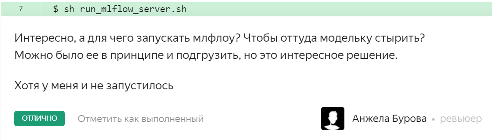

Привет, Николай! 
Меня зовут Анжела Бурова и сегодня я твой ревьюер. Предлагаю общаться на ты, но если тебе не комфортно перейдем на вы.
Извини за долгое ревью, у нас отвалился один ревьюер и теперь еле успеваем.
Сначала несколько организационных моментов:
Ты можешь задавать любое количество вопросов, уточнять что-то у меня в любой момент, добавив свои комментарии, например в Readme, или можешь создать дополнительный .txt файлик с комментариями. Они обязательно будут рассмотрены. А также пиши если что-то было непонятно по ходу выполнения проекта, в общем любые вопросы.
Есть 3 типа комментариев:
оранжевый - надо исправить. Это те комментарии которые обязательно нужно исправлять.
серый - можно лучше, это рекомендуется исправлять, но если нет возможности можно оставить прежним.
зеленый - похвала или развивающие материалы.
Дальше по проверке.
Это очень классно что ты написал юнит тесты, и что есть проверка работоспособности с адеватным красивым логом. Хвалю! Никто так еще не делал)
По коду добавила несколько комментариев. Посмотри, поправь что сможешь. По запускам смотри ниже: мне нужен энв файлик для запуска. По запуску млфлоу - я не поняла обязательно это или нет, но раз уж ты добавил в инструкцию то я попробовала запустить. Но если это необязательный момент, можно не исправлять. На следующей итерации запущу остальные этапы
### Этап 1
Запустился: 
* Тестирование да
* проверка работоспособности да
* в requirements не хватает prometheus_fastapi_instrumentator, так что сервис запустился не сразу
Техническая реализация: 
Нужные файлы:
Комментарии: 
У меня не запустился млфлоу, при запуске скрипта следующая ошибка:
You may be able to resolve this warning by setting modelconfig['protectednamespaces'] = ().
  warnings.warn(
/home/mle-user/.local/lib/python3.10/site-packages/pydantic/internal/config.py:321: UserWarning: Valid config keys have changed in V2:
 'schemaextra' has been renamed to 'jsonschemaextra'
  warnings.warn(message, UserWarning)
2024/06/19 16:33:55 ERROR mlflow.cli: Error initializing backend store
2024/06/19 16:33:55 ERROR mlflow.cli: invalid literal for int() with base 10: ''
Traceback (most recent call last):
  File "/home/mle-user/.local/lib/python3.10/site-packages/mlflow/cli.py", line 426, in server
    initializebackendstores(backendstoreuri, registrystoreuri, defaultartifactroot)
  File "/home/mle-user/.local/lib/python3.10/site-packages/mlflow/server/handlers.py", line 289, in initializebackendstores
    gettrackingstore(backendstoreuri, defaultartifactroot)
  File "/home/mle-user/.local/lib/python3.10/site-packages/mlflow/server/handlers.py", line 268, in gettrackingstore
    trackingstore = trackingstoreregistry.getstore(storeuri, artifactroot)
  File "/home/mle-user/.local/lib/python3.10/site-packages/mlflow/tracking/trackingservice/registry.py", line 39, in getstore
    return self.getstorewithresolveduri(resolvedstoreuri, artifacturi)
  File "/home/mle-user/.local/lib/python3.10/site-packages/mlflow/tracking/trackingservice/registry.py", line 49, in getstorewithresolveduri
    return builder(storeuri=resolvedstoreuri, artifacturi=artifacturi)
  File "/home/mle-user/.local/lib/python3.10/site-packages/mlflow/server/handlers.py", line 129, in getsqlalchemystore
    return SqlAlchemyStore(storeuri, artifacturi)
  File "/home/mle-user/.local/lib/python3.10/site-packages/mlflow/store/tracking/sqlalchemystore.py", line 150, in init
    ] = mlflow.store.db.utils.createsqlalchemyenginewithretry(dburi)
  File "/home/mle-user/.local/lib/python3.10/site-packages/mlflow/store/db/utils.py", line 228, in createsqlalchemyenginewithretry
    engine = createsqlalchemyengine(dburi)
  File "/home/mle-user/.local/lib/python3.10/site-packages/mlflow/store/db/utils.py", line 284, in createsqlalchemyengine
    return sqlalchemy.createengine(dburi, poolpreping=True, poolkwargs)
  File "<string>", line 2, in createengine
  File "/home/mle-user/.local/lib/python3.10/site-packages/sqlalchemy/util/deprecations.py", line 375, in warned
    return fn(args, kwargs)
  File "/home/mle-user/.local/lib/python3.10/site-packages/sqlalchemy/engine/create.py", line 514, in createengine
    u = url.makeurl(url)
  File "/home/mle-user/.local/lib/python3.10/site-packages/sqlalchemy/engine/url.py", line 738, in makeurl
    return parseurl(nameorurl)
  File "/home/mle-user/.local/lib/python3.10/site-packages/sqlalchemy/engine/url.py", line 796, in parseurl
    return URL.create(name, components)
  File "/home/mle-user/.local/lib/python3.10/site-packages/sqlalchemy/engine/url.py", line 152, in create
    cls.assertport(port),
  File "/home/mle-user/.local/lib/python3.10/site-packages/sqlalchemy/engine/url.py", line 163, in assertport
    return int(port)
ValueError: invalid literal for int() with base 10: ''
### Этап 2
Запустился: Не смогла запустить без env файла. Добавь пожалкйста
Техническая реализация: 
Нужные файлы:
Комментарии:
### Этап 3 - 4
Запустился:
Техническая реализация: 
Нужные файлы:
Комментарии: 


Привет Анжела, рад снова тебя читать! Предлагаю перенести диалог в этот файлик, корректировки в любом случае буду проводить на ВМ. Большое тебе спасибо за то что находишь добрые слова и это сильно мотивирует!

1. Нет проблем по поводу долгого ревью, сам выпал на две недели, уехал в отпуск ибо стратегические проекты нашей компании которые мне как проджекту приходится лидировать доконали, отвечаю тебе при лучине :-) Щучу, но действительно не переживаю сейчас по поводу долгого ревью.
2. 

 ML Flow мне действительно был нужен чтобы сохранить модель в гарантированно верном формате. У тебя он не запустился именно потому что не было того самого .env. Я его добавлю как .env_ml_exaple. Но запускать его смысла нет, я добавил только для того чтобы показать что я выполнил фактический процесс, не симулировал модель, а залогировал и извлек для вывода в прод.
3. Полный путь для сборки Доккер образа подкорректировал, из дирректории /services возможно запустить "облегченной" командой, в Инструкции указал.
4. Образец env_example  накликал для запуска образов. 
5. Приложение app, образец параметров не получается вынести в отдельный файл, не работает категорически.
6.  Вот этот комментарий :
```
response = app.handler.handle(all_params) 

        end_time = time.time() 

        processing_time = end_time - start_time 

        metric_prediction_time_counter.inc(processing_time) 

        for cost in response['cost']: 

            metric_prediction_comparison.observe(cost) 

        return response 

     

    except Exception as e: 
Исключения стоит обрабатывать используя конкретный тип исключения, а не все подряд. Это подскажет разработчикам другим о том какое поведение мы ожидаем от конкретной строчки кода. Кроме того оборачивать сразу много строк кода в исключения не очень хорошая практика, следует оборачивать конкретную строчку. Если это было сделано для дебага, тогда при сдаче проекта(коммите проекта в реальной работе), все дебажные строки удаляются.
```
я прости, но совсем не смог правильно обработать, мысль была в том чтобы собирать внутренние ошибки сервера как метрику, это исключение срабатывает только если сервер начнет лагать. Не суди строго, но поделись пожалуйста как мне лучше выполнить проверку.,

7. Твой комментарий : "Тестовые данные можно было бы нагенерить с помощью библиотеки random, чтобы еще и не завязываться на свои параметры" принят безоговорочно, поправил код в скрипте test.
8. Не выносил в отдельный файл: self.required_model_params = [ 

            'build_year', 'building_type_int', 'latitude', 'longitude', 

            'ceiling_height', 'flats_count', 'floors_total', 'has_elevator', 

            'floor', 'kitchen_area', 'living_area', 'rooms', 'total_area' 

        ] 
Чтобы не плодить отдельных файлов, все равно эти параметры заложены как мандатори требуемые.
9. Выполнил твое справедливое требование о лобавление пустой строки между функциями, супер что педаетично указываешь на культуру кода. Знаю что мне ее не хватает, поэтому очень благодарен за материал.
10. docker-compose.yaml откорректировал по твоей рекомендации, указал переменные.

