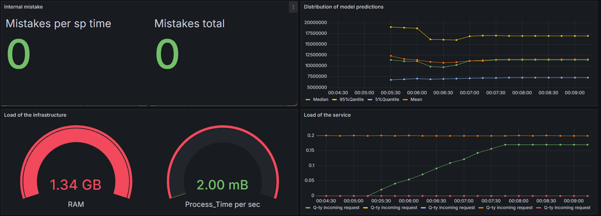

# Мониторинг

## Примененные метрики

**Инрфраструткурные метрики**

Показывают потребление системных ресурсов:
1. Потребление RAM, сколько оперативной памяти занято именно сейчас `process_virtual_memory_bytes`
2. Использование процессорного времени (в секунду) `rate(process_cpu_seconds_total[1m])`

**Метрики прикладного уровня**

Демонстрируют нагрузку на сервис:
1. Количество входящих запросов:`rate(http_requests_total[5m])`
2. Частота входящих запросов  `rate(http_requests_total{handler="/predict"}[1m])`
3. К-во запросов в секунду `rate(http_request_duration_seconds_count[5m])`
4. Внутренние ошибки и их частота   `app_error_counter_total` ,  `rate(app_error_counter_total_total{}[5m])`

**Бизнес-метрики**

Для возможности оценить распеделение предсказаний во вресмени:
1. Среднее значение(скользящее) `delta(app_prediction_comparison_sum[5m]) / delta(app_prediction_comparison_count[5m])`
2. Скользящие значения медианы и квантилей 5%, и 95%:
`histogram_quantile(0.5, delta(app_prediction_comparison_bucket[5m]))`
`histogram_quantile(0.05, delta(app_prediction_comparison_bucket[5m]))`
`histogram_quantile(0.95, delta(app_prediction_comparison_bucket[5m]))`

